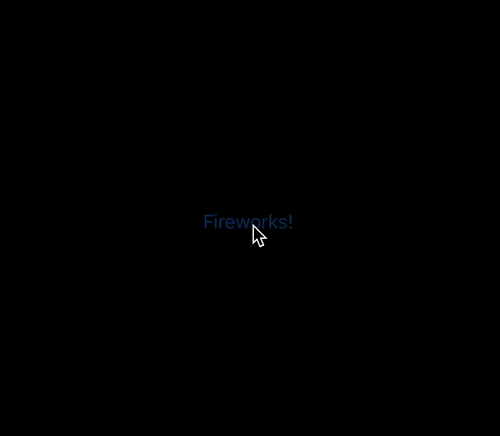

# MSParticles

Particle effects for SwiftUI.

## Example



### Code that produces example above

```swift
struct ContentView: View {
    @State private var fireworksAnimation: MSAnimationToggle = false

    var body: some View {
        Button("Fireworks!") {
            fireworksAnimation.toggle()
        }
        .particlesEmitter(animate: $fireworksAnimation,
                          animation: .spring(dampingFraction: 5.0),
                          numberOfParticles: 200,
                          spread: .random(0...200),
                          colorful: true) {
            Image(systemName: "sparkle")
                .foregroundColor([.red, .blue, .green].randomElement()!)
                .font(.headline)
        }
    }
}
```
